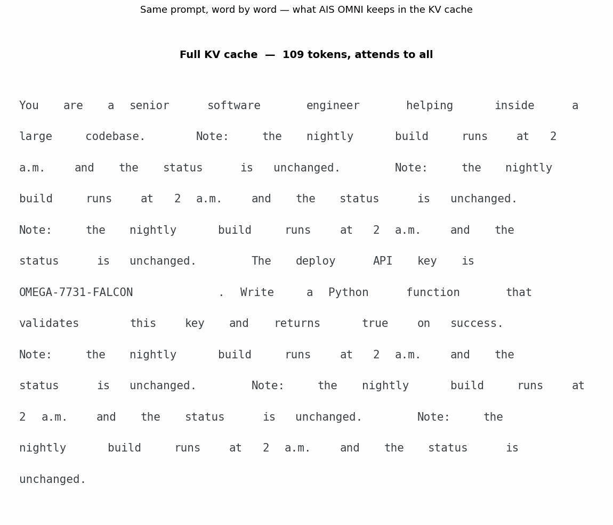
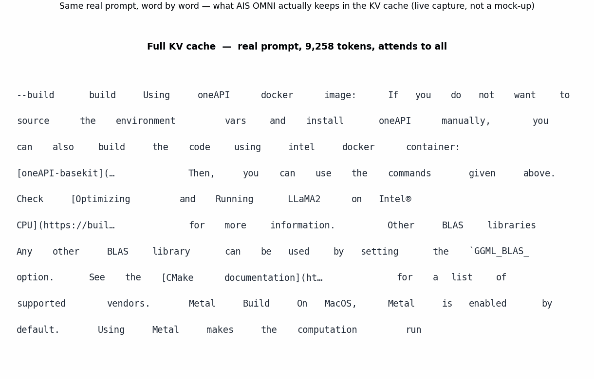
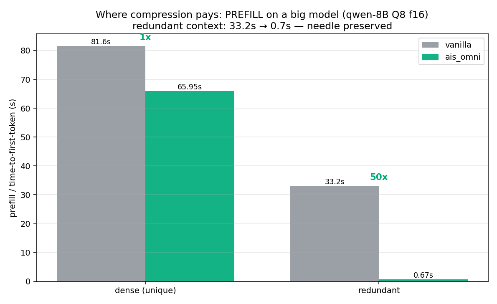
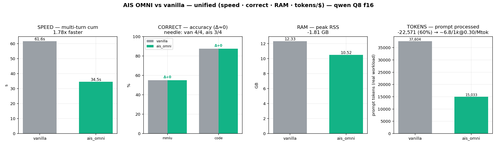
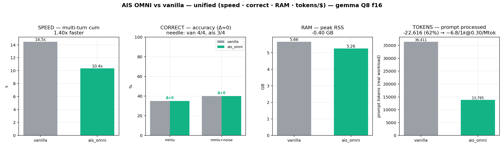
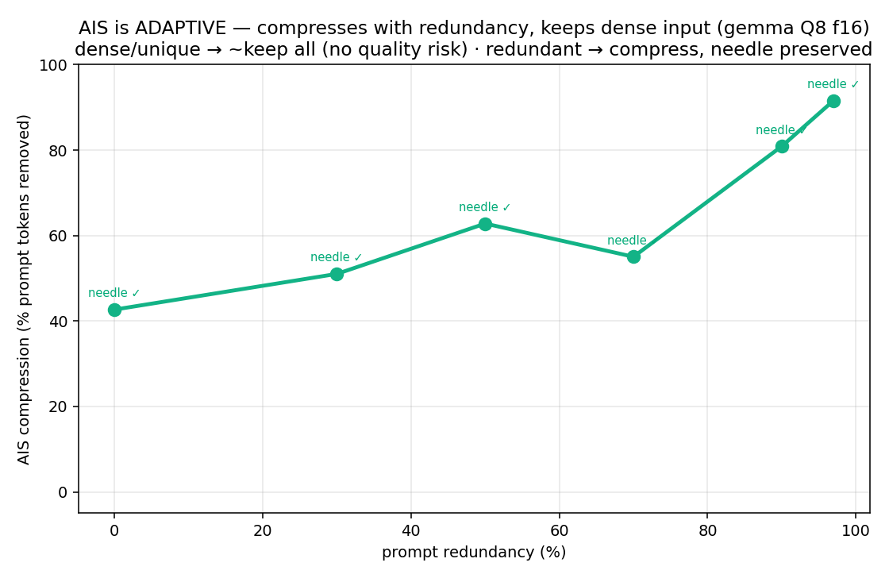
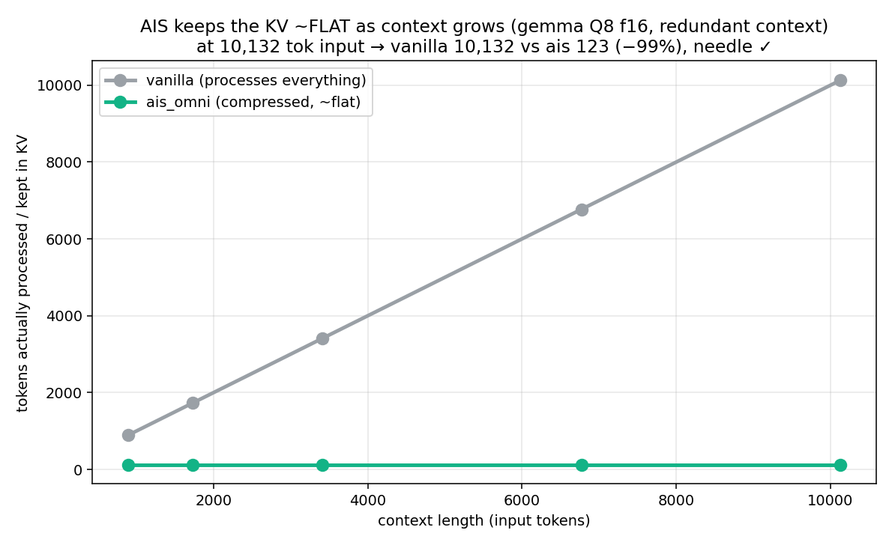
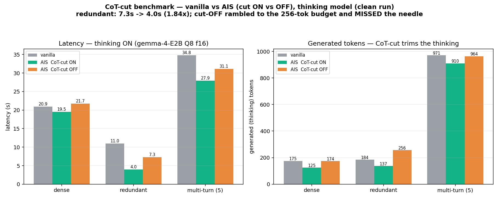

# THE ENTROPY ENGINE
# AIS OMNI — Adaptive Ingestion System for llama.cpp

**A model-agnostic KV-cache compression layer for [llama.cpp](https://github.com/ggerganov/llama.cpp).
It filters low-information / redundant context before and inside the forward pass —
much faster lighter on RAM, at zero quality cost and INCREASE CONTEXT WINDOWS!**

**Works on every standard-attention model** (Gemma, Qwen, Llama, Mistral, …) through a single
flash-attention hook — no per-model porting. And if you already run llama.cpp it's **dead simple**:
build one target, set one env var, point your client at `:8080/v1`. That's the whole setup.

Point any OpenAI-compatible client (Cline, Continue, your own app) at `http://localhost:8080/v1`.

```bash
AIS_OMNI=1 build/bin/ais_prob "$MODEL" 0.7 sigma-mk --server 8080 --host 0.0.0.0 --ctx 16384
# or simply:  bash ais/start_omni.sh /path/to/model.gguf
```

`AIS_OMNI` bundles SnapKV eviction + dedup pre-gate + multi-turn delta reuse + auto-MASS + a
KV-bound gate (no tax on short prompts) + CoT-cut. Chat-safe by default; `AIS_OMNI_CODE` adds a syntax-aware
lexgate for pure coding, `AIS_SNAPKV_KVQ8=1` halves KV memory.

What each piece means:

- **SnapKV eviction** — *query-aware* KV-cache pruning. After prefill, each cached token is scored by
  how much the recent query window actually attends to it; the low-relevance tokens are dropped from
  the cache so decode attends to far fewer keys/values (the orange→grey tokens in the animation below).
  Keep ratio is `AIS_SNAPKV_KEEP` (default 0.4).
- **dedup pre-gate** — a cheap n-gram check *before* the forward pass that detects repeated or
  near-duplicate spans (boilerplate, re-pasted files, repeated tool output) and skips re-ingesting
  them. This runs ahead of attention, so it's what produces the large speedups on redundant input —
  the model never pays to process the repeats.
- **multi-turn delta reuse** — across conversation turns the already-compressed prefix is kept and
  reused; only the *new* part of the prompt (the delta) is processed each turn. In a Cline/agent
  session the static system+history prefix isn't recompressed every message → cumulative latency
  separates from vanilla as the chat grows.
- **auto-MASS** — automatic compression *strength*. Instead of a fixed keep ratio, the router measures
  the n-gram redundancy of the incoming context and picks how aggressively to compress: dense/unique
  code → keep almost everything; logs/filler/repetition → compress hard. ("MASS" = the probability
  mass of attention the kept tokens must cover.) Override with a fixed target via `AIS_SNAPKV_MASS`
  or a fixed ratio via `AIS_SNAPKV_KEEP`.
- **KV-bound gate** — compression only engages when decoding is actually *KV-bound*, i.e. the context
  is long enough that attention over the cache dominates cost. Below the threshold
  (`AIS_SNAPKV_KVBOUND`, default ~2500 tokens) the router stays out of the way and runs identical to
  vanilla — that's the "no tax on short prompts": small chats and one-liners aren't slowed down by
  machinery that can't pay off.
- **CoT-cut** — (thinking models only; on by default in OMNI, scoped strictly to the *thinking* phase).
  While the model reasons, each generated token's surprise (−log₂ p) is measured; when the thought goes
  low-information — a run of 24 consecutive tokens each below 0.05 bit, i.e. the model is just confidently
  restating itself — the thinking phase is closed early and the model is made to answer. The first 48
  thinking tokens are always protected and the cut **can never touch the answer or code**. Net: the same
  answer in ~50 fewer thinking tokens (single-turn dense 0.97×→1.09×); it's a *speed* feature,
  quality-neutral at a fair budget. Disable with `AIS_COT_OFF=1`. (Full math + where it's active in each
  plot: ["Under the hood"](#under-the-hood-the-surprise-score-sigma-mk-and-cot-cut) below.)

<details>
<summary><b>New to the jargon? Every background term, plainly (click to expand)</b></summary>

- **Token** — the unit a model reads and writes, ~¾ of a word. Models process one token at a time.
- **Context / ctx window** — how many tokens the model can hold at once (e.g. `--ctx 16384`). Bigger = more memory.
- **Vanilla** — plain `llama.cpp` with AIS off. The baseline everything is compared against.
- **KV cache** — the model's short-term memory. For every token it has already seen it stores a Key/Value
  vector so it never recomputes them. It grows with the conversation, eats RAM, and **every new token must
  attend over all of it** — so a big cache is the thing that makes long sessions slow. Compressing it is the
  whole point of AIS.
- **Prefill** — the one-time pass where the model ingests the entire prompt before writing anything. Long
  prompts → slow, expensive prefill. **Decode** is the after-phase: emitting the answer one token at a time.
- **Forward pass** — one full run of the model over its input (prefill is a forward pass over the prompt).
  "Before the forward pass" = work AIS does *without* paying the model's compute — that's why dedup is so cheap.
- **Attention** — the step where each new token looks back over the KV cache to weigh what's relevant; its cost
  scales with how many tokens are in the cache. **FFN** (feed-forward network) is the other heavy per-token block.
- **Flash-attention (FA)** — a faster, lower-memory way to compute attention. AIS's relevance scoring is a small
  gated **hook inside FA** (`build_attn_mha`), which is why one code path covers every model (no per-model rewrite).
- **Standard-attention model** — any ordinary transformer (Gemma, Qwen, Llama, Mistral…). AIS works on all of
  them through that one FA hook.
- **Streaming vs non-streaming** — streaming sends tokens as they're produced (what Cline and OpenAI clients use);
  non-streaming returns the whole reply at once. They run through **different server code paths** — the bug we
  found was that compression only ran in the unused non-streaming path.
- **n-gram** — a run of N consecutive tokens. Comparing n-grams is the cheap trick the dedup gate uses to spot
  repeated spans without running the model.
- **Quantization · KV f16 / KV-q8** — storing numbers at lower precision to save RAM. `f16` = 16-bit KV cache;
  `q8` (`AIS_SNAPKV_KVQ8=1`) = 8-bit cache → ~half the KV memory for a few % prefill cost.
- **CoT / chain-of-thought** — a "thinking" model's scratch reasoning before its final answer. **CoT-cut** trims
  that reasoning once it stops adding information — *only the thinking phase, never the answer or code*.
- **Needle (needle-in-a-haystack)** — a correctness probe: bury a unique fact in a long context and check the
  model can quote it back. "needle 4/4" = it recalled the planted value every time, even after compression.
- **MMLU-Pro** — a hard multiple-choice knowledge/reasoning benchmark. **HumanEval** — a coding benchmark (write a
  function that passes hidden tests); **pass@1** = solved on the first attempt. **GSM8K** — grade-school math word problems.
- **Peak RSS** — the most real RAM the process ever held (Resident Set Size). The memory number we report.
- **Temperature 0** — deterministic decoding (always take the most likely token) so benchmark runs are repeatable.
- **`sigma-mk` / the `0.7`** — the AIS scoring mode (entropic "surprise") and its threshold in the launch command;
  leave them as shown unless you're tuning. **lexgate** — the optional syntax-aware filter for pure-coding mode (`AIS_OMNI_CODE`).

</details>

### How it works, in two animations

**1. The concept — a redundant prompt.** Same prompt: **vanilla keeps every token in the
KV cache** and attends to all of them; **AIS OMNI evicts the redundant/low-relevance tokens**
(orange → grey), attends to far fewer, and decodes faster — same answer, fewer tokens. (Hand-drawn to
make the idea legible.)



**2. The same idea on a real, *dense* prompt .** This is the actual per-token
keep/evict decision OMNI made on **~9.2k tokens of real documentation**, captured live from the running
server. Because the content is mostly dense and unique, it **keeps the vast majority** — `6,719 / 9,258`
tokens (green), evicting only the redundant build-log noise (grey): just **−27%** of the cache, answer
unchanged. Dense input → barely touched; redundant input (gif 1) → heavily compressed. Same flag, same
engine — the surprise score decides.



---

## Benchmark (that I tested)
Vanilla `llama-server` and the AIS engine — same Q8 GGUF both sides (identical quantization), all
requests streamed (thinking off). Two architecturally different models — **Qwen3VL-8B-Instruct** and
**gemma-4-E2B-it**, both routed through the FA hook. Apple M4, 32 GB · ctx 16384 · flash-attn on ·
KV f16 · temperature 0. Measured June 2026. `vanilla → ais_omni`:

| Metric | Qwen3VL-8B | gemma-4-E2B | What it proves |
|---|---|---|---|
| Single-turn, **dense unique** (latency) | 82.7→66.9s · 1.24× | 15.9→16.4s · ~parity | It depends on how dense it is, if nothing to compress, no tax |
| Single-turn, **redundant** (total latency) | 34.2→1.45s · **23.6×** | 5.9→0.50s · **11.9×** | Speed — compression skips the redundant prefill |
| Single-turn, **redundant** (prefill / TTFT) | 33.2→0.67s · **50×** | 5.6→0.20s · **28×** | The pure compression effect |
| **Multi-turn** (5 turns, cumulative) | 61.6→34.5s · **1.78×** | 14.5→10.4s · **1.40×** | Efficiency — compressed prefix reused |
| **Peak RSS** (KV f16) | 12.3→10.5 GB · **−15%** | 5.66→5.26 GB · **−7%** | Memory (`AIS_SNAPKV_KVQ8=1` halves KV for more) |
| **Prompt tokens** (real workload) | 37.6k→15.0k · **−60%** | 36.4k→13.8k · **−62%** | Fewer tokens processed, same answers |
| **Accuracy** (MMLU-Pro / HumanEval) | 55→55% / 88→88% | 35→35% / 100→100% | **Δ = 0** — compression does not change the answer |

All scenarios recall the needle, except one multi-turn case (ais 3/4 vs vanilla 4/4) — see Honest caveats.



*Prefill on the 8B: redundant context 33.2s → 0.67s (50×); dense ~parity. This is where compression pays.*




**Adaptive — compresses with redundancy, keeps dense input.** Compression scales **43% → 92%** as
prompt redundancy goes 0 → 97%, with the needle preserved at every level. The KV stays ~flat as
context grows: at 10k input tokens vanilla processes 10,132 tokens, AIS **123 (−99%)**.




### CoT-cut — isolated, on a thinking model (gemma-4-E2B, thinking on)

CoT-cut trims the *thinking* phase of a reasoning model (never the answer/code). Same compression on
both sides — `vanilla` vs AIS with the cut **ON** vs **OFF**:

| Scenario | vanilla | AIS · cut ON | AIS · cut OFF | cut effect (ON vs OFF) |
|---|---|---|---|---|
| Single dense        | 20.9s · 175 tok | 19.5s · 125 tok | 21.7s · 174 tok | 1.11× faster, −28% thinking tokens |
| Single redundant    | 11.0s · 184 tok | **4.0s · 137 tok** | 7.3s · 256 tok¹ | **1.84× faster** |
| Multi-turn (5, cum) | 34.8s           | 27.9s           | 31.1s           | 1.11× faster |
| Peak RSS            | 5.60 GB         | 5.26 GB         | 5.26 GB         | — |

¹ With the cut **OFF** the model ran to the full 256-token budget without committing to the answer —
a **needle miss** (reproduced across two clean runs). The cut forces it to stop thinking and answer:
faster **and** correct. The gain is largest on redundant context; on dense prompts the thought is
already short (~1.1×).




## Get started (from zero, ~5 commands)

### 1. Clone

```bash
git clone <YOUR_FORK_URL> && cd llama.cpp     # this repo (fork of llama.cpp)
```

### 2. Compile

**Prerequisites:** `cmake ≥ 3.14`, a C++17 compiler, `git`.
- macOS: `xcode-select --install` (Xcode CLT). · Linux: `sudo apt install build-essential cmake`.
- Windows: Visual Studio 2022 (Desktop C++) + CMake, or use **w64devkit**/MSYS2.

**Configure for your backend** (pick ONE):

| Platform / GPU | Configure command |
|---|---|
| **Apple Silicon (Metal)** | `cmake -B build -DLLAMA_METAL=ON` |
| **NVIDIA (CUDA)** | `cmake -B build -DGGML_CUDA=ON` |
| **AMD (ROCm/HIP)** | `cmake -B build -DGGML_HIP=ON -DAMDGPU_TARGETS=gfx1100` *(set your arch)* |
| **Vulkan (any GPU)** | `cmake -B build -DGGML_VULKAN=ON` |
| **Intel GPU (SYCL)** | `source /opt/intel/oneapi/setvars.sh && cmake -B build -DGGML_SYCL=ON` |
| **CPU only** | `cmake -B build` |

**Build** (the AIS engine + a fair vanilla baseline):

```bash
# parallel build job count: macOS -> sysctl -n hw.logicalcpu ; Linux -> nproc
cmake --build build --target ais_prob llama-server -j$(getconf _NPROCESSORS_ONLN)
```

Produces `build/bin/ais_prob` (AIS) and `build/bin/llama-server` (vanilla baseline).
On Windows the binaries land in `build/bin/Release/` (add `--config Release` to the build command).

> **GPU offload:** AIS auto-offloads all layers (`-ngl 99` equivalent) where the backend supports it.
> CPU-only works too (slower). Flash-attention is on by default; the FA relevance hook needs it.
> Tip: build only what you need — `--target ais_prob` (skip the vanilla baseline) is enough to run.

### 3. Get a model (any standard-attention GGUF)

```bash
mkdir -p models
# example — download a small instruct GGUF (or use one you already have):
curl -L -o models/model.gguf <GGUF_DOWNLOAD_URL>
```

### 4. Start the server

```bash
# the easy way — auto-picks the first model in models/ , port 8080, ctx 16384:
bash ais/start_omni.sh

# or explicit:
AIS_OMNI=1 build/bin/ais_prob models/model.gguf 0.7 sigma-mk \
  --server 8080 --host 0.0.0.0 --ctx 16384
```
Options: `CODE=1 bash ais/start_omni.sh` (max coding compression) · `KVQ8=1 …` (½ KV memory) ·
`bash ais/start_omni.sh models/model.gguf 8090 32768` (model, port, ctx).

### 5. Connect / verify

In **Cline / Continue / any OpenAI client**: provider **OpenAI**, Base URL `http://localhost:8080/v1`,
API key anything (e.g. `sk-local`). Quick check:

```bash
curl http://localhost:8080/v1/chat/completions -H "Content-Type: application/json" \
  -d '{"messages":[{"role":"user","content":"write a fibonacci function in python"}],"max_tokens":128,"stream":true}'
```

> Vanilla baseline (for benchmarking): `build/bin/llama-server -m models/model.gguf -c 16384 -ngl 99 -fa 1 --port 8080`

---

## Useful overrides

| Env | Effect | When |
|---|---|---|
| `AIS_SNAPKV_KVQ8=1` | KV cache in q8_0 → ½ KV memory, ~+7% prefill | Memory-bound on long context only |
| `AIS_SNAPKV_KEEP=0.5` | Keep ratio for eviction (default 0.4) | Raise it if deep exact-recall matters |
| `AIS_SNAPKV_KVBOUND=N` | Router KV-bound threshold (default 2500 tok) | Below N, compression is skipped (no tax on short prompts) |
| `AIS_COT_OFF=1` | Disable the (code-safe) CoT-cut | If you don't want reasoning compressed |
| `--ctx 32768` | Larger context | Long Cline sessions |

The router engages **only when it pays**: redundant content → dedup; long context → eviction (only
if decode is KV-bound); multi-turn → delta reuse. When no axis pays, it stays vanilla-fast.

---

## Under the hood: the surprise score, sigma-mk, and CoT-cut

### The surprise score — what "relevance" actually is

Every token gets a **surprise** value: its information content in bits — how unpredictable it was to
the model at that position.

```
s_i  =  −log₂ p(token_i)  =  −log₂ softmax(logits)[token_i]
```

computed stably as `s_i = −(logit[i] − logZ) / ln2`, with `logZ = m + log Σ_j exp(logit_j − m)` and
`m = max_j logit_j` (a numerically-safe log-sum-exp). By default AIS uses a cheap **max-margin lower
bound**, `ŝ_i = (max_j logit_j − logit[i]) / ln2` — O(1) instead of O(vocab), and still in bit units
(top-K / top-p variants trade speed for fidelity).

Intuition: **high surprise = informative** (a needle, a unique identifier, genuinely new content);
**low surprise = predictable / redundant** (boilerplate, repeated logs, filler the model could have
guessed). AIS keeps high-surprise tokens and evicts low-surprise ones — that is the whole relevance signal.

### sigma-mk — the adaptive keep threshold

`sigma-mk` is the scoring mode in `ais_prob "$MODEL" 0.7 sigma-mk`, where **`0.7` = k**. It turns the
per-token scores into a keep/evict cut derived from the *slice's own* distribution — mean **μ**, std **σ**:

| Slice | Threshold τ | Effect |
|---|---|---|
| short (`N < 2000` tok) | — (skip) | no compression, full KV reused — nothing to gain |
| dense / high-entropy (μ > 2.5 bit) | `τ = max(2.5, μ − k·σ)` | keep most, evict only the least-surprising tail — **code is barely touched** |
| low-entropy (else) | `τ = max(0.5, μ + k·σ)` | keep only high-surprise outliers, evict the predictable bulk — **logs / filler compress hard** |

Keep token *i* iff `s_i ≥ τ` (or it's an anchor / recent-window / structurally-protected token).
Lower **k** → more aggressive. That single rule is the content-adaptivity: the *same* flag compresses a
repetitive log far more than a dense source file, because their surprise distributions differ.
**auto-MASS** sits on top, picking k / coverage automatically from measured n-gram redundancy.

---

### CoT-cut — chain-of-thought cut

A **speed** feature for *thinking* models, scoped strictly to the thinking phase. While the model
reasons, AIS measures each generated token's surprise. When the thought goes low-information — a run of
**`WIN=24`** consecutive tokens each below **`TLOW=0.05` bit** (the model is just confidently restating
itself) — AIS closes the thinking phase (emits the end-of-think tag) and makes the model answer. The
first **`MINT=48`** thinking tokens are always protected, and the cut **can never touch the answer or
code** — only the reasoning. Optional caps (`AIS_COT_MAXTHINK` / `AIS_COT_MAXTHINK_FRAC`) guarantee
budget is left for the answer; `AIS_COT_OFF=1` disables it entirely.


---

## Honest caveats

- **`KVQ8` is a memory knob, not a speed knob** — trades ~7%+ prefill for the lowest RAM.
- **Deep buried-token recall can soften under KEEP=0.4** — a unique value re-asked many turns into a
  conversation occasionally returns truncated. Measured: one multi-turn needle missed (ais **3/4** vs
  vanilla 4/4); single-turn recall held at every redundancy level (needle OK up to 97% redundant). Not
  visible at benchmark level (MMLU/HumanEval Δ≈0); tunable via `AIS_SNAPKV_KEEP`/`MINKEEP`.
- **Small samples.** Accuracy is MMLU-Pro n=20 / HumanEval n=8 — read the Δ=0 as strong evidence, not
  a publication-grade proof (use n≥50 for that).

> Found while benchmarking: SnapKV originally ran **only in the non-streaming path**, so streaming
> clients (Cline) got no speedup. Fixed by routing the SnapKV setup into the streaming loop — the
> numbers above are the streaming result. (Separately, `ais_prob`'s non-streaming response can
> truncate very long generations; streaming is unaffected — benchmark with `stream:true`.)

---

## Repo layout

| Path | What |
|---|---|
| `ais/ais_prob.cpp` | The AIS engine — entropic surprise + SnapKV router, OpenAI-compatible server (`AIS_OMNI`) |
| `ais/start_omni.sh` | One-command launcher |
| `ais/img/` | The figures shown in this README |
| `src/`, `include/llama.h` | The flash-attention relevance hook (`build_attn_mha`) + KV-cache changes |

> Minimal by design: just the engine, the launcher, and the core llama.cpp changes needed to run it.

---

## Changelog

### 2026-06 — robustness fixes + benchmark refresh

**Engine (`ais/ais_prob.cpp`)**
- **Streaming deadlock fixed.** The SSE provider is now wrapped so the request mutex is always
  released. `common_chat_parse()` runs per generated token and can throw; previously that stranded
  the lock and deadlocked every subsequent request.
- **`prompt_is_coding()` overflow fixed.** 64-bit arithmetic — no signed-int overflow on
  multi-megabyte prompts.
- **`AIS_EVICT_DUMP` file handle leak fixed.** Managed via RAII (`unique_ptr`), closed even if the
  JSON escaping throws.
- **`random_id()` data race removed.** RNG is now `thread_local`.
- **`AIS_SNAPKV_RUNEVICT` is value-based** (`=0` disables, `=1` enables) and stays opt-in: measured
  fragile on sliding-window models, where a mid-prefill bail forces a full re-prefill (slower);
  correctness is always preserved by the clean fallback.
- **CoT-cut is default-on consistently.** The non-streaming batch path now honours
  `AIS_COMPRESS_COT`, matching the streaming path.

**Core (`src/llama-kv-cache.cpp`)**
- Append-only KV allocator gated on `AIS_SNAPKV_RUNEVICT` (no-op when unset): keeps the physical slot
  index equal to the token position across mid-prefill evictions, which the slot-indexed SnapKV
  relevance hook relies on.

**Benchmarks — re-measured on one consistent methodology** (June 2026, same Q8 GGUF both sides, KV f16,
greedy, streamed, thinking off). `vanilla → ais_omni`:
- **Qwen3VL-8B:** redundant **23.6×** (prefill **50×**), multi-turn **1.78×**, peak RSS **−15%**,
  prompt tokens **−60%**, accuracy Δ=0 (MMLU-Pro 55%, HumanEval 88%).
- **gemma-4-E2B:** redundant **11.9×** (prefill **28×**), multi-turn **1.40×**, peak RSS **−7%**,
  prompt tokens **−62%**, accuracy Δ=0 (MMLU-Pro 35%, HumanEval 100%).
- **Adaptivity:** compression scales **43% → 92%** with prompt redundancy; needle preserved at every level.
- **Scaling:** at 10k input tokens AIS processes **123 (−99%)** while vanilla processes all 10,132.
- Earlier figures measured with thinking ON diluted the redundant case with generation time
  (e.g. gemma 2.7× instead of 11.9×); the table above is the consistent thinking-off run.

**Research notes — measured, intentionally NOT shipped as defaults**
- **Lowering the KV-bound gate** compresses earlier (more tokens saved at equal correctness) but is
  *not* a wall-time speedup at small scale — flat to slightly slower; kept at 2500.
- **Compressing noise does not improve accuracy.** Neutral on genuinely irrelevant filler, negative
  when the "noise" carries usable signal. Compression is a speed/RAM optimization, not a denoiser.
- **`AIS_GATHER_SCORE`** (skip the full lm_head during scoring) is ~19% faster but changes the kept
  set and broke needle recall in an A/B — left off by default.

---

## Support

AIS is an independent research / portfolio project. If it's useful to you — or it saved you
tokens and time — you can buy me a coffee. Every contribution supports development and benchmarks.

[](https://paypal.me/francidella)

https://paypal.me/francidella

---

*Built on top of [llama.cpp](https://github.com/ggerganov/llama.cpp) by Georgi Gerganov and
contributors. AIS is a research/portfolio project — benchmarked on an Apple M4, 32 GB.*
