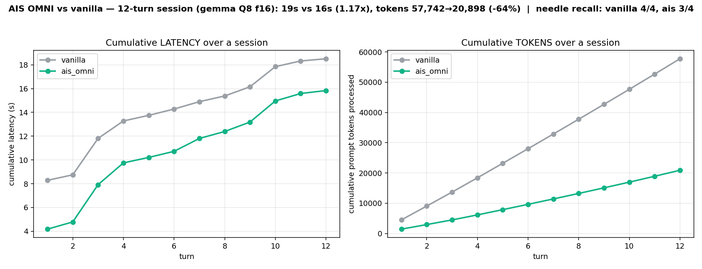

# AIS — Adaptive Ingestion System (per llama.cpp / Gemma-4)

> **The Entropy Engine** — compressione del contesto guidata dalla
> **sorpresa di Shannon** (entropia per-token): tiene i token informativi, scarta il
> ridondante **prima** del forward-pass. Stessa qualità, meno token, meno RAM, più veloce.

Modulo di **compressione del contesto** sopra llama.cpp: filtra i token poco
informativi/ridondanti **prima** dell'inferenza → stessa qualità, contesto effettivo
più grande, e su contenuti ridondanti molto più veloce.

**Comandi pronti da copia-incollare: vedi [`COMANDI.md`](COMANDI.md).**

La ricerca completa, i benchmark e i risultati misurati stanno in
`./PROJECT_GUIDE.txt` (v3.7, in questa cartella). Questo file è solo il
**quick-start operativo**. NB: oltre alle due modalità qui sotto esiste **SnapKV**
(compressione contesto query-aware, la più veloce in multi-turno) e un track di **bench su
un modello piccolo che ragiona (E2B)** → vedi `start_ais.sh [cot|snapkv|vanilla]`,
`PROJECT_GUIDE.txt` e `../../llama.gpp/COMANDI_SERVER.txt`.

---

## File (cosa sta dove)

| File | Ruolo |
|---|---|
| `ais/ais_prob.cpp` | Motore **entropico** (sorpresa di Shannon) — server OpenAI + CLI. **Consigliato.** |
| `ais/ais.cpp` (`ais`) | Motore **lessicale** (dedup n-gram, zero forward-pass) — velocissimo su doc ridondanti, qualità inferiore. |
| `src/models/gemma4-iswa.cpp` | **FORK DEL GRAFO Gemma-4**: lm_head condizionale + gather-dot (vedi sotto). |

> **Il grafo è forkato** (gemma-4-specifico). La modifica è *gated*: l'inferenza
> Gemma-4 normale è identica all'upstream; il percorso custom si attiva SOLO in
> modalità embeddings (cioè quando lo usa AIS). Su un update di llama.cpp,
> `src/models/gemma4-iswa.cpp` va ri-applicato.

---

## Compilare

```bash
cmake --build /Users/fra/Desktop/llama.cpp/build --target ais ais_prob \
      -j$(sysctl -n hw.logicalcpu)
# ricostruisce anche libllama (per il fork del grafo). Nessuna dipendenza extra.
```

---

## LA MODALITÀ FINALE: `AIS_OMNI` (server su :8080, per Cline / client OpenAI)

Avvia **un** server alla volta e punta il client a `http://localhost:8080/v1`.
`MODEL=models/<il-tuo-modello>.gguf` (qualsiasi modello standard-attention).

**Una flag, tutto incluso.** Streaming-native (Cline ne beneficia), ogni modello via hook FA (gemma
incluso, niente fork), dedup + delta + auto-MASS + gate KV-bound, KV f16. Chat-safe (niente lexgate).
```bash
AIS_OMNI=1 build/bin/ais_prob "$MODEL" 0.7 sigma-mk --server 8080 --host 0.0.0.0 --ctx 16384
# oppure:  bash ais/start_omni.sh "$MODEL"           # CODE=1 / KVQ8=1 come env
```
Misurato (streaming, giugno 2026, stesso GGUF **Q8** per i due lati = stessa quantizzazione, **KV f16**,
greedy, thinking off): qualità **Δ=0** (MMLU-Pro + HumanEval), e su contesto lungo/ridondante/multi-turno
→ prefill **28–50×**, ridondante **12–24×**, multi-turno **1.40–1.78×**, RAM **−7/−15%**, token **−60/−62%**.
Numeri completi e grafici: **[Benchmark reali](#benchmark-reali-giugno-2026)**.
Override: `AIS_OMNI_CODE=1` (coding, +lexgate) · `AIS_SNAPKV_KVQ8=1` (½ KV ma **più lento**: q8 paga il
dequant — usalo solo se memory-bound) · `AIS_COMPRESS_COT=1` (CoT-cut, SOLO chat-thinking — tronca il
codice). `AIS_SNAPKV_BEST` resta come alias.

---

## Benchmark reali (giugno 2026)

**Setup onesto:** stesso file GGUF **Q8** per vanilla e AIS (= **stessa quantizzazione**), **KV f16**
(default, punta alla velocità — il q8 rallenta), **greedy**, richieste **in streaming** (come Cline).
Mac M4 32GB (Metal). Modelli: **gemma-4-E2B-Q8** (veloce) e **Qwen3VL-8B-Q8** (forte).

### Riepilogo `vanilla → ais_omni`

| Metrica | gemma-E2B | qwen-8B |
|---|---|---|
| **Accuratezza** (MMLU-Pro / HumanEval) | 35→35% / 100→100% (**Δ=0**) | 55→55% / 88→88% (**Δ=0**) |
| **Singolo ridondante** (latenza totale) | 5.9s → 0.50s (**11.9×**) | 34.2s → 1.45s (**23.6×**) |
| **Singolo ridondante** (prefill / TTFT) | 5.6s → 0.20s (**28×**) | 33.2s → 0.67s (**50×**) |
| **Singolo denso/unico** | ~parità | ~parità (1.24×) |
| **Multi-turno** (latenza cumulativa, 5 turni) | 14.5→10.4s (**1.40×**) | 61.6→34.5s (**1.78×**) |
| **RAM** (peak RSS) | 5.66 → 5.26 GB (−7%) | 12.33 → 10.52 GB (**−15%**) |
| **Token prompt** (workload reale) | **−62%** | **−60%** |

### Dove la compressione paga: prefill su modello grande

Contesto ridondante: **33.2s → 0.67s (50×)**, needle preservato. Denso/unico: ~parità (niente da comprimere).

### Vista unificata — velocità · correttezza · RAM · token


### Adattività — comprime con la ridondanza, tiene l'input denso

Compressione **43% → 92%** al crescere della ridondanza (0→97%), **needle OK a ogni livello**.

### Multi-turno — le curve si separano (sessione tipo-Cline, 12 turni)

Token cumulativi **57.7k → 20.9k (−64%)**. Recall needle: vanilla 4/4, **ais 3/4** (vedi onestà sotto).

### Scaling — la KV resta ~piatta al crescere del contesto

A 10k token di input: vanilla processa **10 132** token, AIS **123** (**−99%**).

### Token e soldi
AIS lavora **−60/−79% di prompt token** a risposte identiche. In costo:
- **Per-input-token** (se esponi un'API): ~**$2–21 / 1000 sessioni** (a $0.10–$1.00 per 1M token input).
- **Self-host (tempo-GPU)**: il risparmio in secondi c'è **solo** nel regime long-context/multi-turno
 (es. qwen prefill 50×); sui prompt corti AIS è a parità.

### Onestà (leggi prima di citare)
- Su **prompt corti/densi** AIS è a **parità o leggermente più lento** (il router salta la compressione
  → *no win, no harm*). Il guadagno in tempo richiede **contesto lungo / multi-turno / modello grande**.
- **Recall multi-turno**: misurato **ais 3/4** vs vanilla 4/4 (un needle perso sotto compressione
  multi-turno aggressiva). Single-turn: needle OK ovunque (anche al 97% di ridondanza).
- gemma-E2B ha il prefill così veloce che il tempo è dominato dalla generazione → la storia di
  velocità è più netta su **qwen-8B**.
- Campioni modesti (MMLU n=20, HumanEval n=8) → per un claim "da paper" servono n≥50.

Script riproducibili in `ais/bench/`: `bench_final.py`, `bench_tokens.py`, `bench_scaling.py`,
`bench_multiturn.py`, `bench_redundancy.py`, `kvbound_sweep.py` + `plot_*.py`.

---

## Le modalità storiche (riferimento)

`MODEL=models/<il-tuo-modello>.gguf`

### 1) VANILLA (baseline, nessun filtro) — `llama-server`
```bash
build/bin/llama-server -m "$MODEL" \
  -c 32768 -ngl 99 -fa 1 -ctk q8_0 -ctv q8_0 --port 8080 --host 0.0.0.0
```

### 2) AIS (entropico, qualità piena) — `ais_prob`
```bash
build/bin/ais_prob "$MODEL" 0.7 sigma-mk \
  --server 8080 --host 0.0.0.0 --ctx 32768 \
  --cache-type-k q8_0 --cache-type-v q8_0      # q8_0 → RAM ~ come vanilla
```
- `0.7 sigma-mk` = soglia adattiva (avg±0.7σ); salta la compressione su doc < 2000 tok.
- Riusa il prefisso tra i turni (delta path) come la prompt-cache di llama-server.
- Per contenuti ridondanti (log, file dump ripetuti) anteponi `AIS_DEDUP=1` (vedi sotto).

### (opzionale) AIS lessicale, massima velocità — `ais` (solo CLI)
```bash
echo "$PROMPT" | build/bin/ais "$MODEL"     # dedup n-gram, ctx 8192, no server
```

---

## Flag d'ambiente di `ais_prob` (env)

| Var | Effetto | Quando |
|---|---|---|
| **`AIS_ADAPTIVE=1`** | **Motore "per tutti"**: gate a costo zero → XML denso/corto (Cline) = vanilla (no tassa, meno RAM); testo ridondante/piano = compressione. Misurato: Cline 35.5s→27.4s, RAM 21.6→19.8GB; log Pass1 ~14s→1s.  il dedup-path a compressione estrema può far perdere coerenza (usare con giudizio). | **Consigliato come default.** |
| **`AIS_COMPRESS_COT=1`** | **Comprime il chain-of-thought online** (Gemma-4): il modello pensa, ma quando il ragionamento entra in un tratto a bassa informazione (sorpresa < 0.05 bit per 24 token consecutivi, dopo 48 protetti) AIS chiude il pensiero e passa alla risposta → tiene i token significativi, scarta il flusso ripetitivo. Misurato: 19.6s/553tok → 12.3s/341tok (−37%), codice identico, niente leak. Stream + non-stream. Tuning: `AIS_COT_TLOW/WIN/MIN`; **tetto anti-ramble** `AIS_COT_MAXTHINK_FRAC` (taglia a f·max_tokens → lascia budget alla risposta = + accurato/veloce); `AIS_COT_TOPK` (sorpresa via top-K). | **Consigliato con thinking model.** Più veloce, qualità preservata. |
| **`AIS_SNAPKV=1`** (+ `AIS_SNAPKV_AUTO=1 AIS_SNAPKV_W=24`) | **Compressione del CONTESTO query-aware** (SnapKV) + delta multi-turno: tiene i token a cui la query presta attenzione, evicta il resto (~50%). KV f16. Manopole `AIS_SNAPKV_MASS/KEEP/MINKEEP`. **Richiede il fork del grafo → solo Gemma-4** (rilevanza via `ais_snap_rel`, flash ON). | **Multi-turno, max velocità (~1.5×), Gemma-4.** Vedi COMANDI_SERVER.txt / PROJECT_GUIDE. |
| **`AIS_SNAPKV_CODE=1`** (coding) | **= BEST + lexgate SYNTAX-AWARE** (protegge codice/identificatori/valori, comprime prosa/commenti). Misurato (Qwen3VL, file commentato 2054 tok, cold): **9.83s vs vanilla 10.87s** (più veloce!), prompt-tok 1330 (−35%), RSS 8.8 vs 9.4GB, **comprehension corretta**. È l'unico che batte vanilla a singolo turno: il lexgate toglie token PRIMA del forward → riduce il prefill vero. | **Coding / Cline.** |
| **`AIS_OMNI=1`** | **LA MODALITÀ FINALE (vedi sopra).** Una flag: SnapKV via hook FA (OGNI modello, gemma incluso — fork rimosso) + dedup + delta + auto-MASS + gate KV-bound, KV f16. **Streaming-native** (Cline). NIENTE lexgate (chat-safe) né CoT-cut (tronca il codice → opt-in). `AIS_OMNI_CODE`=+lexgate. Misurato streaming: ridondante ~14×, multi-turno ~1.4×, RAM −16/−24%, qualità Δ≈0. | **Default consigliato.** |
| `AIS_SNAPKV_BEST=1` | **Alias di OMNI** (stessa logica; storicamente auto-routing fork per Gemma). Mantenuto per retro-compatibilità → preferisci `AIS_OMNI`. | Legacy. |
| `AIS_SNAPKV_LEXGATE=1` (+ `AIS_LEXGATE_WIN=3 AIS_LEXGATE_THR=2.0`) | **Surprise-neighbor gate (pre-forward, model-agnostic)**: droppa il filler a bassa sorpresa LESSICALE (forma del token: niente maiuscole/cifre/simboli) che NON sta entro `WIN` da un token importante → quei token non entrano nel forward (skip attenzione, gratis). Auto-adattivo: misurato **88% su prosa/commenti, 28–36% su codice denso**; i valori/codici ad alta sorpresa (cifre/CamelCase) sono PROTETTI → comprehension corretta (es. `param_q42_94` recuperato). Lossy sul lowercase isolato (stile della risposta deriva). **Consigliato per coding** (sempre on). Funziona su TUTTI i modelli (anche mrope/ISWA). | Coding / prompt con prosa. |
| `AIS_SNAPKV_DEDUP=1` | Dedup pre-gate per il path SnapKV: rimuove gli n-gram esatti ripetuti **prima** del prefill (skip attenzione+FFN per quei token, gratis). Guard: se toglie ≥50% disattiva l'eviction per-rilevanza (evita di perdere dettagli esatti). Incluso in BEST. | Prompt ridondanti. |
| **`AIS_SNAPKV_FA=1`** (+ `AIS_SNAPKV_AUTO=1 AIS_SNAPKV_W=24 AIS_SNAPKV_KEEP=0.4`) | **SnapKV per QUALSIASI modello, FLASH ON** (consigliato per non-Gemma). La rilevanza `[n_kv]` è calcolata **dentro `build_attn_mha`** (`src/llama-graph.cpp`, hook gated) per ogni layer ad attenzione piena → un solo punto, niente fork per-modello, e l'attenzione principale resta flash. Stessa eviction host-side. Validato su Qwen3VL-8B: **parità di velocità con vanilla**, 50% compressione, retrieval pieno; readback 0.9ms. Si somma a KV q8_0.  | **Modelli ad attenzione standard (Qwen3, Llama, ...).** Vedi `SNAPKV_NOTES.md`. |
| **`AIS_SNAPKV_GENERIC=1`** | Come sopra ma **flash OFF** (cattura `kq_soft_max` via `cb_eval`): funziona anche dove `build_attn_mha` non passa, ma è ~5–25% più lento. **Fallback** quando `AIS_SNAPKV_FA` non capta la rilevanza. | Fallback. Mutuamente esclusivo con gli altri `AIS_SNAPKV_*`. |
| `AIS_REASON_EVICT=1` (+ `AIS_REASON_KEEP=0.4`) | **Reasoning eviction**: a fine pensiero evicta dalla KV i token di ragionamento a bassa sorpresa (filler), tiene i sostanziali + la conclusione → la risposta decodifica contro una KV più piccola. Riusa la sorpresa del CoT-cut (zero compute extra).  Misurato: utile solo con **prompt denso + ragionamento lungo** (altrimenti la compressione del prompt ha già tolto la pressione KV → nessun guadagno). Vedi `SNAPKV_NOTES.md §6-bis`. | Nicchia (long-reasoning). |
| `AIS_DEDUP=1` | Pre-gate dedup n-gram (esatti) prima del forward-pass; **salta automaticamente i prompt XML-densi** (Cline) per sicurezza | Doc/sessioni ridondanti (log, NIAH). Su log: 96% in meno → Pass1 ~1s. |
| `AIS_GATHER_SCORE=1` | Salta l'lm_head completo nello scoring (gather-dot) → Pass1 −15% | Più veloce ma fedeltà sorpresa minore (R²~0.5). Non default. |
| `AIS_NBATCH=512` | n_batch più piccolo → ~3GB di RAM in meno | Cambia l'accumulo float (output diverso). Memoria-bound. |
| `AIS_VALIDATE_GATHER=1` | Diagnostica: confronta gather-dot vs lm_head pieno (Pearson) | Debug/validazione. |
| *(nessuna)* | **Default = qualità piena** (vera sorpresa, lm_head completo) | Uso normale. |

Flag CLI: `--cache-type-k/v {f16,q8_0}`, `--flash-attn {on,off,auto}`, `--ctx N`,
`--max-tokens N`, `--server PORT`, `--host H`.

---

## Il fork del grafo in breve (`gemma4-iswa.cpp`)

In coda al build, dopo il final-norm: cattura `hidden` (pre-lm_head); l'lm_head 256k
diventa **condizionale**; in modalità scoring calcola il **target-logit** per token
(`hidden · W_out[token_successivo]`) con un solo prodotto scalare invece della
proiezione completa. Validato: Pearson 0.999 vs lm_head pieno. Ricetta per portarlo su
un altro modello: stesso blocco nel relativo `src/models/<arch>.cpp` (dettagli in
PROJECT_GUIDE, sezione "GATHER-DOT / RICETTA DI PORTING").

---

## Cosa NON usare (testato e scartato)

- **Speculative decoding**: su questo MoE A4B è più LENTO (28→18-20 t/s), il target è
  già veloce. Vedi `ais/bench/bench_spec.sh`.
- **Scorer con modello piccolo off-the-shelf**: la sua sorpresa non combacia col 26B
 (overlap keep-set ~4%). Serve distillazione. Vedi PROJECT_GUIDE.

---

## Benchmark (in `ais/bench/`)

`bench_cline.sh` (multi-turno vanilla vs ais), `bench_ais_redundant.sh` (prova velocità
su doc ridondante), `bench_longrun.py` (proiezione sessioni lunghe), `bench_spec.sh`
(spec decoding — negativo). I benchmark storici con dataset HuggingFace
(`bench_ais_compare.py`, `bench_ais_full.py`) richiedono un venv con `huggingface_hub`
+ un token HF. Risultati e analisi completi: `./PROJECT_GUIDE.txt`.
